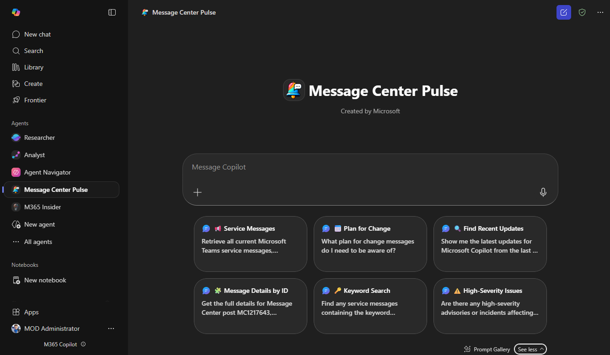
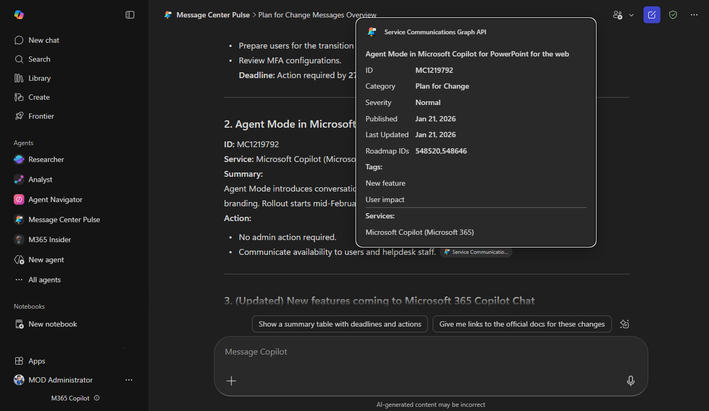

# Message Center Pulse — Microsoft 365 Message Center Agent 📢

Message Center Pulse is a declarative agent built in the Agents Toolkit for the Microsoft 365 Copilot. It helps IT administrators query, filter, and understand Microsoft 365 Message Center posts - including service changes, advisories, and incidents using the Microsoft Graph Service Communications API.
It leverages adaptive cards to provide consistent formatting in responses.

---

> **Note:** This agent is not intended to replace or be a duplication of the official 1st party 'Microsoft 365 Admin' agent. For full administation coverage, Microsoft recommends using the Microsoft 365 Admin agent. This agent is solely tailored to Message Center posts only. Read more about the admin agent here - https://learn.microsoft.com/en-us/copilot/microsoft-365/copilot-for-microsoft-365-admin.

This agent leverages the [Microsoft Graph Service Communications API](https://learn.microsoft.com/en-us/graph/api/resources/service-communications-api-overview?view=graph-rest-1.0), specifically the [serviceAnnouncement/messages](https://learn.microsoft.com/en-us/graph/api/resources/serviceannouncement?view=graph-rest-1.0) endpoint, to retrieve Message Center data directly from Microsoft 365.

---

> **Note:** Once deployed, only users with the appropriate Microsoft 365 admin roles will be able to use the agent and query the Service Communications API. Eligible roles include:
> - Global Admin
> - Service Support Admin
> - Message Center Reader

For more details on required roles, see the [Microsoft Graph Service Communications API documentation](https://learn.microsoft.com/en-us/graph/api/resources/service-communications-api-overview?view=graph-rest-1.0#permissions).

## ✨ What it does (current iteration)

- Answers questions about Microsoft 365 Message Center posts (service changes, advisories, incidents).
- Supports filtering by service (Teams, Exchange, SharePoint, etc.), category, severity, message ID, date, tags, and keywords.
- Provides the id of the associated Microsoft 365 Roadmap item in the adaptive card response, if applicable.
- Leverages adaptive cards for rich, business-friendly responses.
- Always retrieves data directly from the Service Communications API (does not use model knowledge).

Suggested prompts to try:
- *"Retrieve all current Microsoft Teams service messages, including advisories and incidents"*
- *"Show me the latest updates for Microsoft Copilot from the last 7 days"*
- *"Get the full details for Message Center post MC1217643, including category and roadmap IDs"*
- "*What plan for change messages do I need to be aware of?"*

---

##  Future iterations

- Ability to be called/invoked by the [M365 Insider Agent](https://github.com/alexc-MSFT/m365-insider/) as a child agent.

---

## 🚀 Getting Started

You can deploy directly from VS Code using the **Microsoft 365 Agents Toolkit** (evolution of Teams Toolkit) and publish the agent to your organization or test locally, see [Microsoft 365 Agents Toolkit Overview](https://learn.microsoft.com/en-us/microsoftteams/platform/toolkit/agents-toolkit-fundamentals). **Before you can run or deploy the agent, you must register an app in Microsoft Entra and the Teams Developer Portal and obtain the OAuth client registration ID.**

1. Ensure you have the Agents Toolkit extension for Visual Studio Code installed ([Install Agents Toolkit](https://learn.microsoft.com/en-us/microsoftteams/platform/toolkit/install-agents-toolkit?tabs=vscode#install-a-prerelease-version)).
2. Clone the [repo](https://github.com/alexc-MSFT/mc-pulse.git) to your machine.
3. **Register an app in Microsoft Entra** (see [Registering an App in Microsoft Entra](#️-registering-an-app-in-microsoft-entra)).
4. **Register the app in the Teams Developer Portal** (see [Registering the App in Teams Developer Portal](#-registering-the-app-in-teams-developer-portal)).
5. **Open the folder in VS Code**.
5. **Update the `ai-plugin.json` file** in this project. Set the following field to your OAuth client registration ID:

	"reference_id": "{YOUR OAUTH CLIENT REGISTRATION ID GOES HERE}"

6. Follow the steps in the [Tutorial: Create declarative agents by using Microsoft 365 Agents Toolkit](https://learn.microsoft.com/en-us/microsoft-365-copilot/extensibility/build-declarative-agents) to provision the agent.
7. Deploy the agent for the required users through the MAC.

> **Note:** When users interact with the agent for the first time, they will need to sign in and consent for the Service Communications API. This should only be required once or if the agent has been updated. 

---

## 🛡️ Registering an App in Microsoft Entra

To enable the agent to call the Microsoft Graph Service Communications API, you must register an app in Microsoft Entra and grant the required permissions.

1. Create a new app in Microsoft Entra. 
2. Name your app (e.g. "Message Center Pulse Agent").
3. After registration, copy the **Application (client) ID** and **Directory (tenant) ID** as you will need these later.
5. Generate a new client secret, copy the **Value** and keep for later.
6. Grant the following API permissions for the Microsoft Graph:
	- `ServiceMessage.Read.All` (Delegated)
7. Grant admin consent for your organization.
8. Add the following Redirect URI (Authentication tab) as follows:
	- Platform Type: Web, URI: https://teams.microsoft.com/api/platform/v1.0/oAuthRedirect
---

## 🪟 Registering the App in Teams Developer Portal

1. Go to the [Teams Developer Portal](https://dev.teams.microsoft.com/) and create a new OAuth client registration.
2. Set the **Registration name** e.g. "Message Center Pulse Agent".
3. Configure the options as follows:

Base URL: **https://graph.microsoft.com/v1.0**

Restrict usage by organization: **'My Organisation only'**

Restrict usage by Teams app: **'Any Teams app (for testing and store validation only)'**. 

**Note - you may want to change this and restrict it to the app registration for a production deployment.**

Client ID: **ID of your Entra app registration**

Client Secret: **Secret value for your Entra app registration**

**Replace {TENANT_ID} below with your tenant ID that you copied earlier.**

Authorization endpoint: `https://login.microsoftonline.com/{TENANT_ID}/oauth2/v2.0/authorize`

Token endpoint: `https://login.microsoftonline.com/{TENANT_ID}/oauth2/v2.0/token`

Refresh endpoint: `https://login.microsoftonline.com/{TENANT_ID}/oauth2/v2.0/refresh`

Scope: `ServiceMessage.Read.All`

Enable Proof Key for Code Exchange: **'Off/false'**

Client password authentication method: **'Request body parameters (default)'**

4. Click 'Save'.
5. Copy the generated **OAuth client registration ID**.

---

## 🎨 Customising the Agent

- **Name**: Feel free to change the name of the agent to suit your needs.
- **Instructions**: Refine the agents instructions and responses by editing the instruction.txt file.  
- **Knowledge**: Add public websites or internal knowledge sources to improve coverage.  
- **Actions**: Add additional API plugins as required.

---

## 🤝 Contributing

Contributions are welcome! 

If you'd like to improve the agent, update documentation, suggest new ideas etc. please open an issue or submit a PR.

Open an issue or submit a PR if you’d like to improve prompts, filters, or documentation.

---

## 🛟 Support

This solution is open-source and community provided with no active community providing support for it. This solution is maintained by both Microsoft employees and community contributors and is not a Microsoft provided solution so there is no SLA or direct support for this from Microsoft. Please report any issues by raising an issue.

---

## 📜 License

This project is licensed under the [MIT License](LICENSE).
